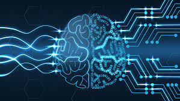
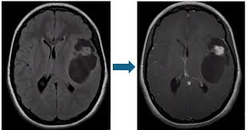
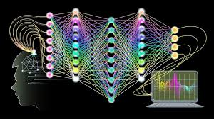
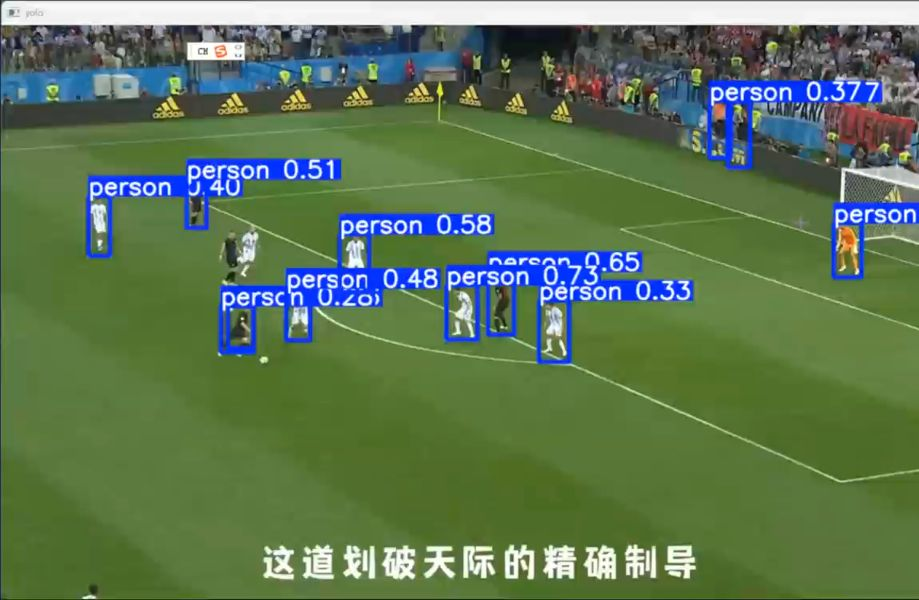

# 新闻视频（音频）
[news_video.mp4](news_video.mp4)
# 新闻文稿中英对照
* **Biomedical engineering** researchers at John's Hopkins University are working to transform **heart patient care**. 
* 约翰霍普金斯大学的**生物医学工程**研究人员正在努力改善**心脏病患者护理**。 

* They can now create a personalized **digital model** of a patient's heart, a **digital twin** and use **artificial intelligence** to help better predict who is most at risk. [句型分析1](#句型分析1)
* 他们现在可以为病人的心脏创建一个个性化的**数字模型**，一个**数码孪生体**，并使用**人工智能**来更好地预测谁的发病风险最大。 

* We do **contrast enhanced MRI** of the heart and then we combine that contrast, enhanced MRI with all the **clinical data** that's known for the patient. 
* 我们对心脏进行**对照增强核磁共振成像**，然后将共振成像与所有已知的病人**临床数据**结合起来。 

* This is combined with **survival analysis** and we can tell, over 10 years, what is the risk of a patient of having **sudden cardiac death**. [句型分析2](#句型分析2)
* 与**生存分析**相结合后，我们可以知道，10年以后，病人**心脏性猝死**的风险是多少。 

* Unlike **segmented images** most often used today, professor **Natalia Trayanova** says the whole images of the heart produce more accurate predictions of which patients need **defibrillators**. [句型分析3](#句型分析3)
* 与目前最常用的**分割图像**不同，**纳塔莉亚教授**表示，心脏的整体图像可以更准确地预测哪些患者需要**除颤器**。 

* We provide these **deep learning algorithms** that are **multimodality**, they represent the patient's condition much better. 
* 我们提供了这些**多模态**的**深度学习算法**，它们能更好地代表病人的状况。 

* At the **Sydney Kimmel Comprehensive Cancer Center** at Johns Hopkins, Dr **Victor Velculescu** is leading research into developing new ways of detecting early stage **lung** and other **cancers**. 
* 在约翰霍普金斯大学的**悉尼金梅尔综合癌症中心**，**维克多·威尔克斯库博士**正在领导一项研究，开发检测早期**肺癌**和其他**癌症**的新方法。 

* He and his team observed that **cancer cells** grow and replicate more chaotically than normal cells. 
* 他和他的团队观察到**癌细胞**的生长和复制比正常细胞更混乱。 

* So when those cells die they leave behind telltale characteristics of **fragments of DNA** circulating in the blood called **Cell-Free DNA**, which carries clues about whether a person may have cancer. [句型分析4](#句型分析4)
* 因此，当这些细胞死亡时，它们会留下在血液中循环的**DNA片段**的特征，称为**无细胞DNA**，它携带着一个人是否患有癌症的线索。 

* The team developed a technology called **DELFI** which uses novel **machine learning algorithms** to analyze fragments of that **Cell-Free DNA**. 
* 该团队开发了一种名为**德尔菲**的技术，该技术使用新颖的**机器学习算法**来分析**无细胞DNA**的片段。 

* We look in the blood, we identify molecules of DNA called **Cell-Free DNA**, and we look for the profile or the patterns of this **Cell-Free DNA** as a way to identify those individuals who have cancer versus those that don't. 
* 我们会观察血液，识别被称为**无细胞DNA**的**DNA分子**，我们会寻找这种**无细胞DNA**的轮廓或模式，以此来识别哪些人患有癌症，哪些人没有。 

* Local Schools says improved **blood tests** could lead to greater **cancer screenings** worldwide. 
* 当地学校表示，改进的**血液检测**可能会导致全球范围内更多的**癌症筛查**。 

* **Julie Tabo** **VOA news**, **Baltimore Maryland**. 
* **VOA新闻**，**朱莉·塔博**马里兰州**巴尔的摩**报道。

# 注解
## 复人名 & 专有名词
* biomedical engineering: 生物医学工程
* heart patient care: 心脏病患者护理
* digital model: 数字模型
* digital twin: 数码孪生体
* artificial intelligence: 人工智能
* contrast enhanced MRI: 对比增强核磁共振成像
* survival analysis: 生存分析
* sudden cardiac death: 突发心脏病死亡
* segmented images: 分割图像
* professor Natalia Trayanova: 纳塔莉亚教授
* multimodality: 多模态
* cancer cells: 癌细胞
* Cell-Free DNA: 无细胞DNA
* DELFI: 德尔菲
* machine learning algorithms: 机器学习算法
* novel: 新颖的
* blood tests: 血液检测
* cancer screenings: 癌症筛查
* Baltimore Maryland: 巴尔的摩州玛利亚
* Julie Tabo: 朱莉·塔博
* VOA news: VOA新闻
* VOA: 美国之音
* Sydney Kimmel Comprehensive Cancer Center: 悉尼金梅尔综合癌症中心
* Dr Victor Velculescu: 维克多·威尔克斯库博士
* lung cancer: 肺癌
* telltale characteristics: 特征性印记
* Cell-Free DNA: 无细胞DNA
* DNA fragments: DNA片段
* fragments: 片段

## 长难句详解
### 句型分析1
#### ___They___ can now ___create___ ___a personalized digital model___ of a patient's heart, a digital twin, and ___use___ ___artificial intelligence___ to help better predict who is most at risk.
* 同位语：a digital twin（即“数字孪生体”，对前面的“digital model”进行补充说明）
* 宾语从句（who 引导）：who is most at risk（谁风险最大）
##### 主语：They（指研究人员）
##### 谓语动词：can create（可以创建）、use（使用）
##### 宾语：a personalized digital model of a patient’s heart（病人的个性化数字模型）

### 句型分析2
#### ___This___ is ___combined with___ ___survival analysis___ and we can tell, over 10 years, what is the risk of a patient of having sudden cardiac death.
* 状语（时间）：over 10 years（在 10 年内）
* 宾语从句（what 引导）：what is the risk of a patient of having sudden cardiac death（病人患心脏性猝死的风险是多少）
##### 并列句（and 连接）：
##### 主语：This（指前面提到的 MRI 数据和临床数据的结合）& we 
##### 谓语：谓语：is combined with（与……结合）& can tell（可以判断）

### 句型分析3
#### Unlike segmented images most often used today, ___professor Natalia Trayanova___ ___says___ ___the whole images of the heart produce more accurate predictions of which patients need defibrillators.___
* 状语：Unlike segmented images most often used today（不同于今天常用的分割图像）
* 定语从句（which 引导，修饰 predictions）：of which patients need defibrillators（哪些病人需要除颤器）
##### 主句：professor Natalia Trayanova says（Natalia Trayanova 教授说）
##### 宾语从句（由 that 省略）：the whole images of the heart produce more accurate predictions...

### 句型分析4
#### So when those cells die ___they___ ___leave behind___ ___telltale characteristics___ of fragments of DNA circulating in the blood called Cell-Free DNA, which carries clues about whether a person may have cancer.
* 定语从句（which 引导，修饰 Cell-Free DNA）：which carries clues about whether a person may have cancer（它携带着一个人是否患癌的线索）
##### 主语：they（指 cancer cells，癌细胞）
##### 谓语：leave behind（留下）
##### 宾语：telltale characteristics（明显的特征）
##### 定语：of fragments of DNA circulating in the blood（修饰 telltale characteristics，指的是“在血液中循环的 DNA 片段”）
##### 同位语：called Cell-Free DNA（补充说明 “fragments of DNA” 即 “无细胞 DNA”）

## 背景知识扩充
### 1. 生物医学工程 (Biomedical Engineering) ###
#### Definition
* 生物医学工程是一个将工程原理和设计方法应用于医学和生物学的学科，目的是改善健康、治疗疾病、提升医疗技术的效率与安全性。它涉及开发用于诊断、治疗和监控疾病的设备、技术和系统，推动医疗服务的创新。
* #### Applications
* 医疗设备设计：例如，心脏起搏器（pacemaker）、人工关节（artificial joints）等。
* 治疗方法的开发：如基因治疗（gene therapy）和再生医学（regenerative medicine）等。
* 健康监测工具：例如可穿戴设备（wearable devices）和远程医疗技术（telemedicine）等。
#### Examples
* 人工心脏瓣膜：用于替代患有心脏瓣膜病的患者受损的瓣膜，帮助恢复正常的血液流动。
* 功能性假肢：如通过电动技术控制的假肢，能够恢复失肢者的运动功能。
* 脑机接口（BCI）：通过直接与大脑信号互动来控制外部设备，为残疾人提供了与世界互动的新方式。
* 生物打印：例如3D打印技术，用于打印人工器官和组织，推动组织再生和移植手术的发展。
#### Future Trends
* 智能医疗设备：随着人工智能和物联网的发展，医疗设备将变得更智能，能够实时监控患者健康并自动调整治疗方案。
* 再生医学与器官打印：通过3D打印和细胞培养技术，可能会实现人工器官的打印和移植，为解决器官短缺问题提供可能的解决方案。
* 脑-机接口（BCI）技术：随着脑科学和技术的不断进步，BCI技术将在神经科学、康复医疗和人机互动方面发挥越来越大的作用。

### 2. 数字孪生体 (Digital Twin) ###

#### Definition
* 数字孪生体是物理实体或过程在虚拟世界中的精确数字化复制。它通过集成实时数据、历史数据和传感器数据，借助物联网（IoT）、人工智能（AI）、大数据和模拟技术，创建物理对象或系统的虚拟模型。这一虚拟模型能够反映其在现实世界中的状态，并预测未来的行为和性能。
* Components:
  * 物理实体或系统：这是需要被数字化模拟的对象，可以是机械设备、建筑物、城市基础设施、人体等。
  * 虚拟模型：基于物理实体的数据和参数创建的数字模型，通常涉及三维建模、仿真、模拟等技术。
  * 数据源：通过传感器、物联网设备、人工智能算法等获取的数据，实时反映物理实体或过程的状态。
  * 数据分析和模拟：利用数据分析、机器学习等技术对获取的数据进行处理，模拟和预测物理实体的行为。
  * 反馈机制：虚拟模型与物理实体之间的双向数据交换，使得虚拟世界可以优化、调整物理系统，反之亦然。
* #### Applications
* 制造业： 通过数字孪生体对生产线的虚拟仿真，可以优化生产流程、提升生产效率、降低故障率, 利用传感器数据实时监控设备状态，预测设备故障，从而实现预测性维护，减少停机时间。
* 建筑与城市建设：数字孪生体可以用来模拟和管理城市基础设施（如交通、能源、建筑等），实现更加智能化的城市管理与服务。
* 能源管理：通过数字孪生体模拟太阳能、风能等可再生能源设施的运行，优化能源产出，降低运行成本。 心脏病管理：医生可以创建患者心脏的数字孪生体，实时观察心脏的工作状态，从而提前发现潜在的风险。
#### Examples
* 制造业中的数字孪生体：一家汽车制造厂使用数字孪生体来模拟生产线的每个环节，实时获取设备和操作的相关数据，提前识别潜在问题，实现设备故障预测和维修调度，从而提高生产效率并减少停机时间。
* 智慧城市中的数字孪生体：在一个智慧城市项目中，创建了整个城市的数字孪生体，包括交通、能源消耗、建筑等数据。通过实时监控和数据分析，能够对交通流量进行预测并优化，减少拥堵，并实时管理能源消耗，提升城市的可持续性。
* 健康领域的数字孪生体：通过患者的数字孪生体，医生可以根据其实时生理数据，模拟不同治疗方法对患者的影响。比如，对于一个心脏病患者，可以创建其心脏的数字孪生体，模拟手术后的恢复情况或药物治疗的效果。

### 3. 人工智能 (Artificial Intelligence, AI) ###

#### Definition
* 人工智能是指通过计算机程序模拟人类智能的过程，尤其是在人类需要进行学习、推理、问题解决、理解语言、感知环境等任务时。AI系统可以通过数据、经验和算法进行自我改进，使其能够在没有明确编程的情况下执行复杂任务。
* Components:
  * 弱人工智能（Narrow AI）
  * 强人工智能（General AI）
  * 超人工智能（Super AI）
#### Applications
* 医疗健康（Healthcare）
  * 诊断与治疗：AI可以通过分析医学影像，辅助医生进行病变检测和诊断，提供更为精准的治疗方案。比如，AI在乳腺癌、肺癌等疾病的早期诊断中取得了显著成效。
  * 个性化医疗：利用患者的基因数据、生活习惯等，AI可以为每个患者定制个性化的治疗计划。
  * 药物研发：AI可以加速药物的研发过程，模拟药物分子的结构与作用，提高药物研发效率。

* 自动驾驶（Autonomous Driving）
  * AI通过计算机视觉、深度学习和传感器数据处理，使得车辆能够自主感知周围环境并做出决策，逐步实现无需人工干预的自动驾驶。
* 金融服务（Finance）
  * 智能投顾：AI可以分析市场趋势、投资组合和个人偏好，为用户提供个性化的投资建议。
  * 欺诈检测：AI利用机器学习算法分析交易数据，识别和预防欺诈行为。 
  * 风险评估与信贷审批：AI通过大数据分析对客户的信用状况进行评估，帮助银行和金融机构做出更加准确的信贷决策。
* 客户服务（Customer Service）
  * 聊天机器人：AI驱动的聊天机器人可以为客户提供实时在线咨询、解答问题，提升客户服务效率。 
  * 语音助手：如Apple的Siri、Amazon的Alexa等，通过语音识别与自然语言处理技术，帮助用户控制智能设备、获取信息等。

### 4. 对照增强核磁共振成像 (Contrast-Enhanced MRI) ###  

#### Definition
* 对照增强核磁共振成像（CE-MRI）是一种基于MRI技术的影像增强方法，它通过注射或口服对比剂，使得图像中的某些区域比周围组织更加清晰。对比剂通常由含有磁性元素（如镓、钇等）的化合物组成，能够影响核磁共振信号的强度，从而提高图像的对比度和细节，帮助医生更好地观察组织结构的异常或病变。
* Principle
  * 在常规MRI中，核磁共振信号是通过样本中的氢原子与强磁场和射频波相互作用生成的。然而，MRI对于某些组织（如脑部、肌肉和软组织）之间的对比度较低。对比剂通过注射进入体内后，会改变该区域的磁共振信号，增强图像中病变或异常组织的显示，使其与周围正常组织区别更加明显。
    常见的对比剂通常含有钆（Gadolinium），它是一种具有强磁性的元素。当对比剂被注射进入患者体内后，它会在局部区域停留并增加该区域的信号强度，尤其是在血管、肿瘤和感染等区域中。因此，对比增强MRI可以帮助医生观察到更微小的病变，改善诊断准确性。
* #### Applications
* 肿瘤检测与评估：对比增强MRI常用于肿瘤的评估，尤其是在肝脏、乳腺、脑部、前列腺等部位。通过增强肿瘤区域的信号，帮助医生明确肿瘤的位置、大小和形态，从而为治疗方案的制定提供重要信息。
* 血管疾病： 通过对比增强MRI进行血管成像，可以清晰显示血管的结构、狭窄或堵塞等病变。特别适用于检测动脉粥样硬化、血栓形成、动脉瘤等疾病。
* 中枢神经系统疾病：对于脑肿瘤、脑血管病变、脑炎等疾病，CE-MRI能够增强病变区域的可见度，帮助评估疾病的性质和范围，特别是在无明确症状时。

### 5.深度学习 (Deep Learning) ###

#### Definition
* 深度学习是一种机器学习的技术，它通过多层（深度）神经网络模型来模拟人类大脑的认知过程，学习和识别数据中的复杂模式。深度学习的“深度”指的是网络中包含多个层次的神经元节点，通过多层次的计算进行数据的抽象和特征提取。它通过大量数据的训练，自动学习出适合的特征表示，从而实现对数据的分类、回归、预测等任务。
* Principle
  * 深度学习的核心是“神经网络”模型。神经网络是由大量的节点（神经元）组成的网络结构，模拟了人类神经系统的信息传递和处理方式。通过输入数据，神经网络通过多个“隐藏层”逐步提取和转换数据特征，最终生成输出。
    * 神经网络的基本结构
      * 输入层（Input Layer）：神经网络的起始层，接收外部输入的数据。例如，在图像分类任务中，输入层接受图像的像素值。
      * 隐藏层（Hidden Layer）：深度神经网络由多个隐藏层组成。每个隐藏层通过加权求和并应用激活函数对输入数据进行处理，提取数据的高级特征。网络中的“深度”指的就是隐藏层的数量。
      * 输出层（Output Layer）：神经网络的最后一层，生成最终的预测结果。例如，分类任务的输出层会输出各个类别的概率。

    * 前馈传播（Feedforward）

      * 数据从输入层进入网络，通过多个隐藏层的逐层处理后传到输出层。这一过程称为“前馈传播”。每一层的节点对输入进行加权和，经过激活函数计算得到输出，并传递给下一层。
    * 反向传播（Backpropagation）

      * 神经网络训练的关键是“反向传播”算法。当网络输出与实际结果之间存在误差时，反向传播算法会通过计算误差的梯度，逐层调整神经网络中的权重和偏置，从而减少误差并优化模型。这一过程不断重复，直到网络的输出逐渐逼近真实标签。
    * 激活函数（Activation Function）

      * 激活函数是神经网络中的重要部分，它决定了神经元是否激活，影响着模型的学习能力。常见的激活函数有：

        * Sigmoid函数：常用于二分类问题，输出值在0和1之间。
        * ReLU（Rectified Linear Unit）函数：解决了Sigmoid函数在大输入值时梯度消失的问题，常用于深度学习的隐含层中。
        * Softmax函数：常用于多分类问题，输出每个类别的概率。
#### Types
* 卷积神经网络（Convolutional Neural Networks, CNN）
* 循环神经网络（Recurrent Neural Networks, RNN）
* 递归神经网络（Recurrent Neural Networks, RNN）
* 生成对抗网络（Generative Adversarial Networks, GAN）
* 自动编码器（Autoencoders）
#### Applications
* 计算机视觉（Computer Vision）
* 自然语言处理（Natural Language Processing, NLP）
* 语音处理（Speech Processing）
* 自动驾驶（Autonomous Driving）
* 金融领域
##### 可以展示一个我自己做的基于深度学习的目标识别和追踪的项目 https://github.com/yzy-pro/Yolov12_test1

